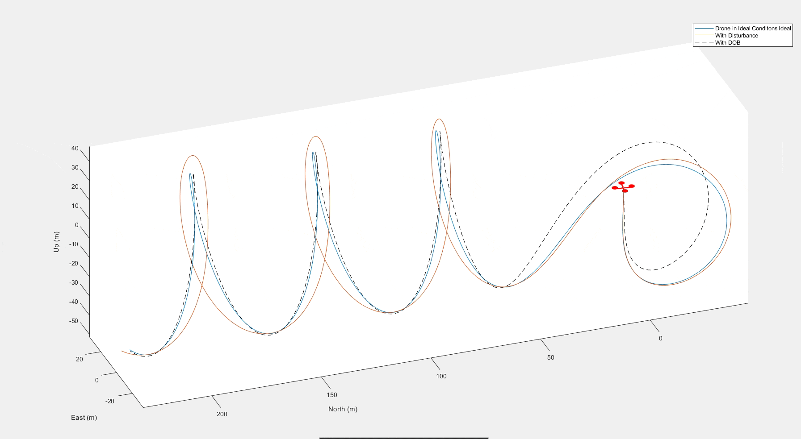

# Disturbance Observer-based Attitude Control of Quadrotor Drones

This project aims to improve the control of quadrotor drones by implementing a disturbance observer-based controller that is capable of detecting and accounting for uncertainties during flight. The proposed controller is designed using state space modeling and takes into account external disturbances in all three axes, making it possible for the drone to perform better in turbulent conditions and provide increased accuracy in its motion control.

## Introduction
Quadrotor drones are versatile unmanned aerial vehicles that are used for various applications in a wide range of domains. However, they are inherently an open-loop unstable and under-actuated system, which poses technical challenges that need to be overcome through robust, precise control of the drone at all times to perform given tasks effectively and accurately without human supervision.

A classical Proportional-Integral-Derivative (PID) controller is commonly used in drones to control their motion. However, its performance is limited in the presence of external disturbances, as the controller does not take into account these external forces. This can cause the drone to deviate from the desired trajectory and oscillate. To address this, a disturbance observer can be used to attenuate the disturbances and reduce the oscillations. The observer's algorithm estimates the disturbance forces based on the measured trajectories and then compensates for the disturbances. The observer can then be used to modify the controller's output, thus allowing the drone to track the desired trajectory more accurately.

## Technical challenges
The disturbance observer has been implemented in a limited scope to account for disturbances in 2D, that is, in the X and Y axis or to account for the ground effect in the vertical Z axis during take-off and landing. The challenge lies in attempting to implement a DOB that can handle disturbances in all three coordinate axes during take-off, flight and landing.

## Approach
Instead of the classical control methods, a geometric tracking controller will be used. This type of controller uses feedback from the system's sensors to continuously adjust the control signals sent to the actuators to correct any deviations from the desired trajectory. The controller calculates the necessary correction by comparing the desired geometric path with the actual position of the system and computing the error between the two. This error is then used to generate the control signals that will drive the system back onto the desired path. The goal of a geometric tracking controller is to enable the system to follow the desired trajectory as closely as possible, with minimal error and maximum accuracy.

To design the controller, the dynamics of the quadrotor are first modeled using state space equations. The equations of motion for the quadrotor are derived using the principles of rigid body dynamics and take into account the mass, inertia, and forces acting on the quadrotor. Next, the disturbance observer is designed using the state space equations. The disturbance observer estimates the external disturbances acting on the quadrotor and uses this information to adjust the control inputs to the quadrotor. Finally, the disturbance observer is combined with a feedback controller to form the overall control system. The feedback controller uses the estimated disturbance and the desired position of the quadrotor to compute the control inputs, which are then applied to the quadrotor to maintain a stable flight.

## Project overview
This project proposes a disturbance observer-based controller for a quadrotor drone. To evaluate the effectiveness of the controller, simulations are performed in a simulated environment. The inputs to the system include the desired position of the quadrotor and external disturbances in the form of step and impulse responses. The output of the system is expected to be a stable flight along all three axes, even under moderate and unexpected disturbances, such as wind gusts. More details can be found in the [Project Report](report/Effect_of_DOB_on_Attitude_Control.pdf).
 

## Simulation
